## CNN_FeatureMaps_Viz
Visualization of VGG-16 Feature Maps using Activation Maximisation proposed by Erhan et. al. in https://www.researchgate.net/publication/265022827_Visualizing_Higher-Layer_Features_of_a_Deep_Network

State of the art Convolutional Neural Networks (CNNs) have begun to match human accuracy in terms of recognizing objects thanks to continued interest in the field of Computer Vision and advancement in Machine Learning methodologies - specifically, deep learning. Neural networks - the heart of deep learning, however, continue to be black boxes which makes it hard to reason about the decisions produced by them.

It is very difficult to understand what a CNN has learnt from a human’s point of view as humans do not understand abstract numbers. Several researchers have developed ways to help a human understand what the network has learnt. For convolutional neural networks, specificaly, many methods have been proposed that help make sense of the network’s knowledge by mapping them to a space that can be understood by humans. In other words, discovering what the network ‘sees’ in an image. 

### Analysing CNN by visualisation
A popular technique to visualise what happens is to plot the filter activations of the network when a specific training input is provided. This technique provides a view of what input `excites` which part of the network. However, in terms of interpretability, the deeper we go into the network, the visualisations become more and more uninterpretable.

[Erhan et al. proposed](https://www.researchgate.net/publication/265022827_Visualizing_Higher-Layer_Features_of_a_Deep_Network) another technique that does not suffer from the above problem. They came up with the idea to treat the maximisation of an activation unit as an optimisation problem, instead of searching through the input space and figuring out which inputs activate which filters. They called this optimization technique - “activation maximization”. The process is as follows:
  * Start with a picture containing random pixels.
  * Apply the pre-network in evaluation mode to this random image
  * Calculate the average activation of a particular feature map within a specific layer of the network from which we then compute the gradients with respect to the random input image pixel values.
  * Knowing the gradients for the pixel values we then proceed to update the pixel values in a way that maximizes the average activation of the chosen feature map.

In our project, we followed this technique to visualise the activation maps of the famous VGG16 model. This project is a reproduction of the work in [this](https://towardsdatascience.com/how-to-visualize-convolutional-features-in-40-lines-of-code-70b7d87b0030) blog post. It was for a different torch version and was modified a little bit to work with the newer version.

### Data and Preprocessing

We use the PyTorch library and the pre-trained VGG16 model that comes with it through the torchvision package and try to visualise what kind of patterns this network has learnt to recognise. In other words, what does the network see when looking at an image. We construct an image array from random pixel values between the range 0-255 and normalise the values to the range 0-1. We then choose a activation map that we want to visualize. Then we use the aforementioned technique to update the pixel values in a way that maximises the activation of the chosen feature map. During training we found that this produces high frequency patterns in the image. So we first started with a random image as before but in a low resolution, normalised it and after each optimisation step, upscaled it by a factor of 12 and introduces a little blur. This resulted in much more smoother images with nice observable patterns. 

### Visualization Results

We noticed that, as expected, the initial layers of the network had learnt to recognise basic shapes/patterns and as the depth of the network increased, the resulting maps learned more abstract and complex patterns. We were thoroughly impressed with the visualizations that this technique was able to create. The results from various layers of the network are shown below. 

#### __Layer 7__

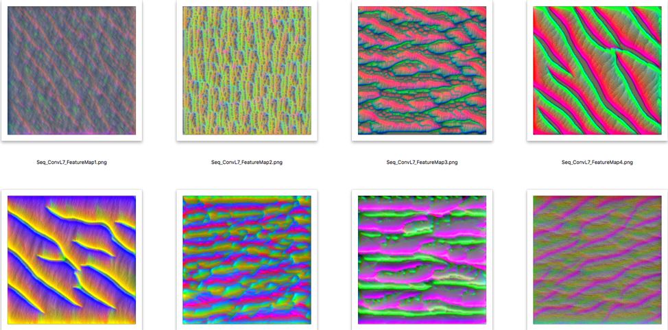

#### __Layer 19__

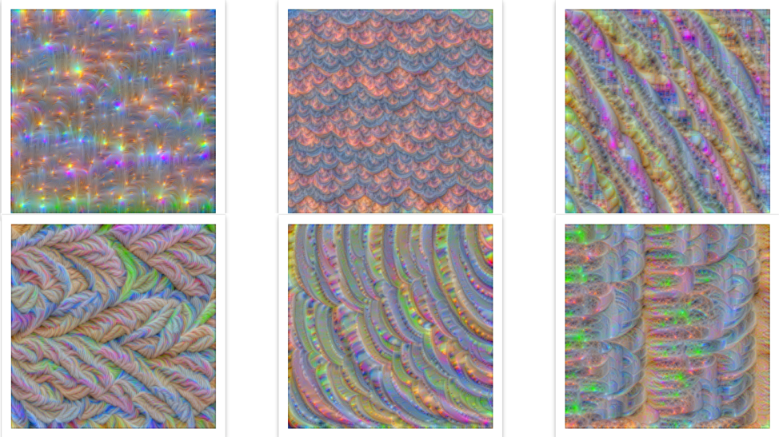

#### __Layer 24__

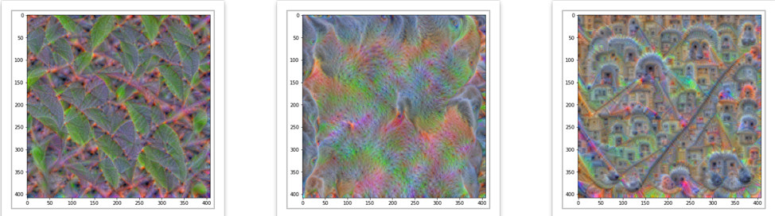
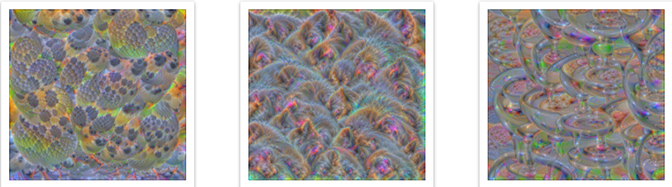
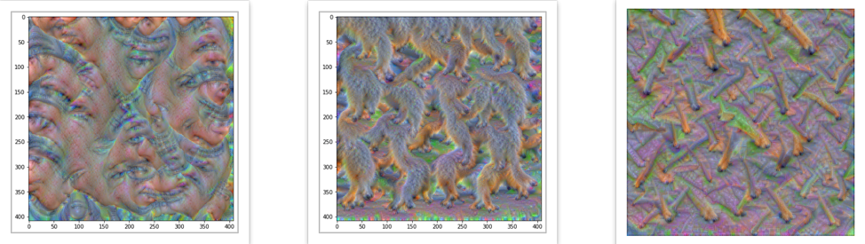

#### __Layer 28__

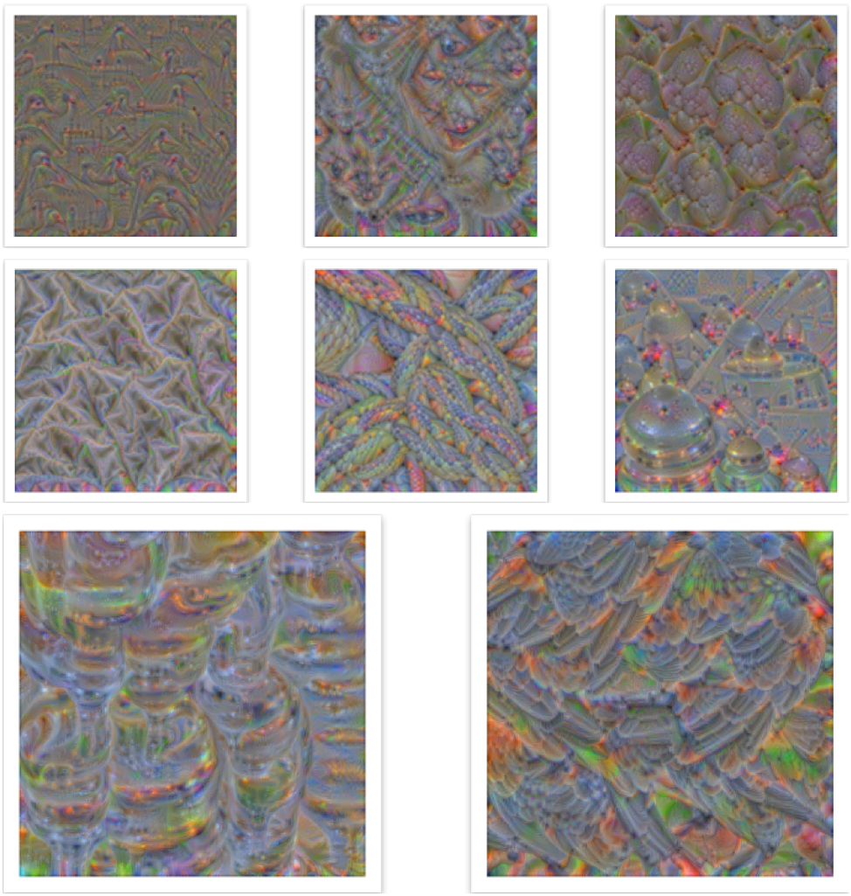

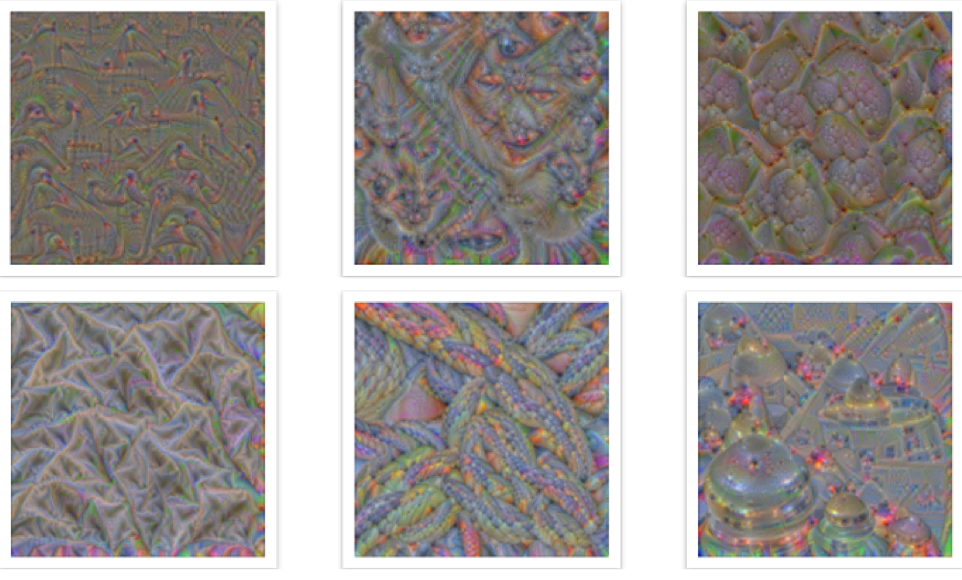

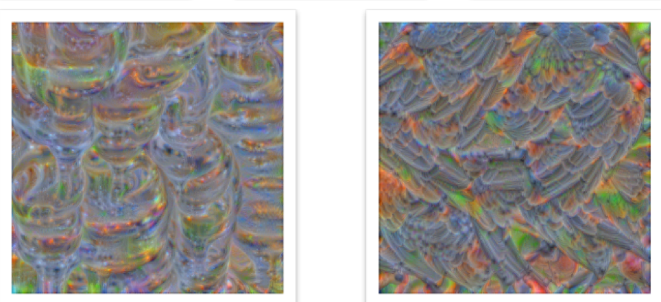

#### Test Hypothesis

Just because the visualisations are interpretable may not necessarily mean that the network is indeed looking at the things that we think it is looking at. To test this, the follwing hypothesis is used.

We would first make note of the what comes to our minds when we see the activation maps. Then we would find an image of the thing that came to our minds. We would run the network on that image and see if the activation of the feature map on the basis of which we chose the image is high. If it is, then we have rightly interpreted the network’s vision through that map. Otherwise, we have wrongly interpreted the feature map. It should be noted that these feature maps are actually just numbers that we are hoping to have clear interpretations when, in fact, it is more likely that they are not because feature maps from one layer of the network are complex combinations of feature maps from the previous layer and they remain interpretable only to the network itself. 

#### Test Image 1 : Building with windows

Our interpretation for the feature map (map 271 in layer 24) in the fig shown below is “A building with many windows”

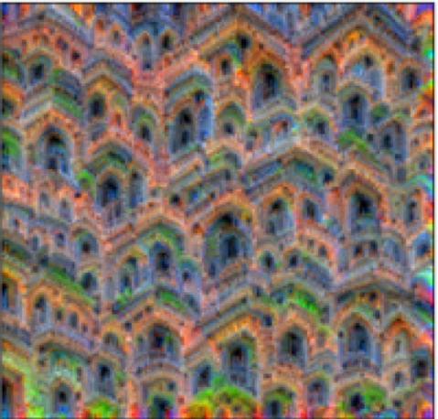

So we find a random image of a building with windows

We run it through the network and note if this map’s((map 271 in layer 24)) activation appears in the top 15 of the 512 feature maps in that layer. 

We note that indeed this feature map is among the top 15 most activated feature maps of conv layer 24.

A figure depicting a plot of the mean activation values from convolutional layer 24, when the test image of a building with windows is supplied as input to the trained VGG16, is shown below. 

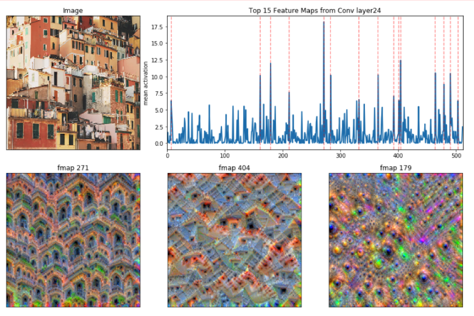

#### Test Image 2 : Leaves

Our interpretation for the feature map (map 15 in layer 24) in the fig shown below is “Leaves”

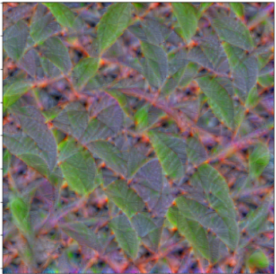

So we find a random image of leaves and note if this map’s activation appears in the top 15 of the 512 feature maps in that layer. We note that indeed this feature map is among the top 15 most activated feature maps of conv layer 24.

A figure depicting a plot of the mean activation values from convolutional layer 24, when the test image of leaves is supplied as input to the trained VGG16, is shown below. 

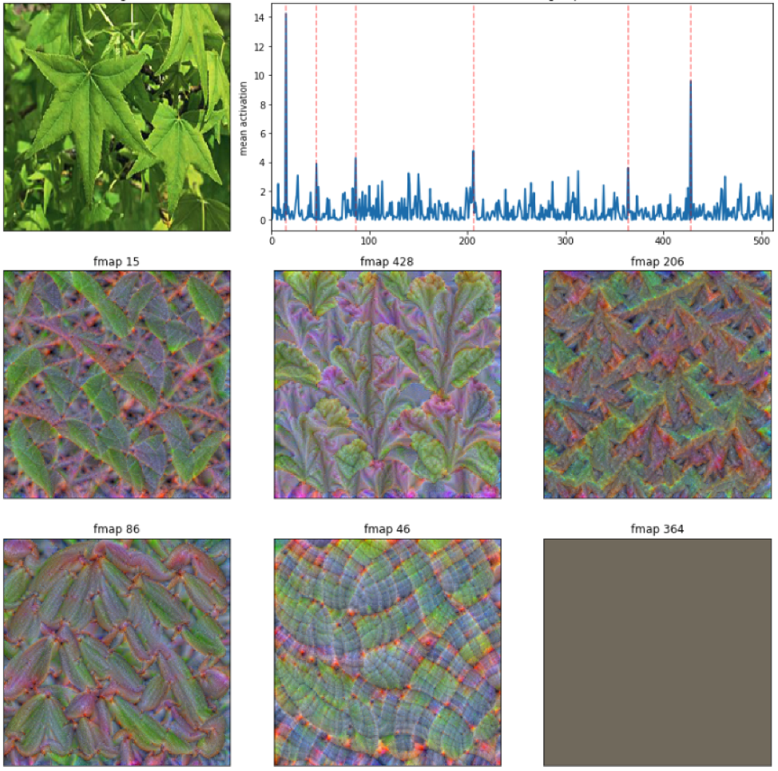

Feature Map 15 is maximally activated for an image of building with windows, confirming our hypothesis.

#### Conclusion
During our analysis, we found that very small percentage of the images were interpretable to humans. Most of the others were complex patterns that we did not show any resemblance to real world objects. Given the high accuracy that the network gives for classification, these feature maps remain understandable only to the network.

Inspired by [this](https://towardsdatascience.com/how-to-visualize-convolutional-features-in-40-lines-of-code-70b7d87b0030) blog post.
